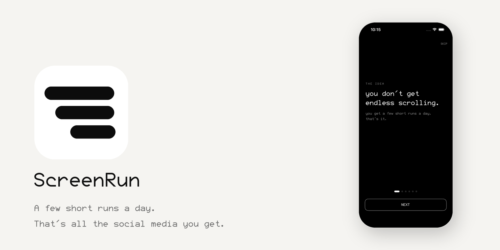

<p align="center">
  
</p>

# ScreenRun

A few short runs a day. That's all the social media you get.

Pick the apps that eat your time. Give each one a run length (3 minutes) and how many runs a day (4). The rest of the day those apps are locked. Tap **Start Run**, the app opens, a timer counts down on your lock screen, and when it hits zero the app locks again. Out of runs? Locked until tomorrow.

That's the whole thing.

## How it works

ScreenRun uses Apple's Screen Time frameworks (Family Controls, Managed Settings, Device Activity) to shield the apps you pick. The block is real. Starting a run unshields one app for its run window. A Device Activity event re-shields it the moment the time is spent, even if ScreenRun isn't open.

- **A run is one timed visit.** You decide how long and how many per day.
- **Shared pool or per-app.** Four runs total across everything, or separate counts per app. Your call.
- **Live Activity timer.** The countdown sits on your lock screen and Dynamic Island the whole run.
- **Commitment lock.** Lock your settings for 1 day, 7, 30, or forever. While locked you can make limits stricter but never looser. Forever means until you delete the app, and the app tells you that before you commit.
- **On device.** No account, no cloud, no analytics. Apple never even hands the app the names of the apps you blocked, they stay opaque tokens.

## Build

Needs Xcode 16+, a physical iPhone, and the Family Controls entitlement (development works on your own device; App Store distribution needs Apple's grant). The Screen Time stack does not run in the Simulator.

```sh
brew install xcodegen
xcodegen generate
open Runs.xcodeproj
```

`project.yml` is the source of truth. The `.xcodeproj` is generated and gitignored.

### Targets

| Target | What it does |
|---|---|
| Runs | the app: UI, run engine, ActivityKit |
| RunsWidget | Live Activity countdown + home screen widget |
| RunsMonitor | Device Activity monitor, re-blocks out of process |
| RunsShield | the custom block screen |
| RunsShieldAction | handles the block screen's button |

All five share state through the `group.com.manif.runs` App Group.

## Type

[Fairfax HD](https://www.kreativekorp.com/software/fonts/fairfaxhd/) by Kreative Software, under the SIL Open Font License. License in `Runs/Fonts/`.

## License

MIT. See [LICENSE](LICENSE).
